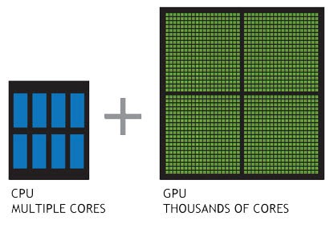
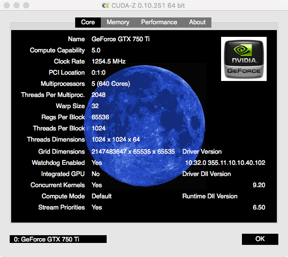

> 老徐
>
> Thursday, 26 July 2018

#  Tensorflow 1.8 macOS GPU Install

> Tensorflow团队宣布停止支持1.2以后mac版的tensorflow gpu版本。
>
> 因此没办法直接安装只能自己用源码编译了。

CPU 运行 Tensorflow 感觉不够快，想试试 GPU 加速！正好自己有一块支持CUDA的显卡。



## 版本

> 重要的事情说三遍：相关的驱动以及编译环境工具必须选择配套的版本，否则编译不成功！！！

版本：

- macOS 10.13.6，这个应该关系不大
- XCode 9.2，请降级到这个版本，否则会编译出错
- TensorFlow 1.8 source code，最新的1.9貌似还有问题
- CUDA 9.2，9.0、9.1、9.2 都可以关系不大
- cuDNN 7.1，7.0、7.1 都可以关系不大
- bazel 0.14.0，请降级到这个版本
- **Python 3.6**，不要使用最新版的 Python 3.7 截止目前编译会有问题

## 准备

需要下载（某些文件较大需要下载，请在继续阅读前先开始下载，节省时间）：

- Xcode 9.2，4.2G

  https://developer.apple.com/download/more/

- bazel-0.14.0，190M

  https://github.com/bazelbuild/bazel/releases/download/0.14.0/bazel-0.14.0-installer-darwin-x86_64.sh


- CUDA Toolkit 9.2，cuda_9.2.148_mac.dmg，1.63G

  https://developer.nvidia.com/cuda-toolkit-archive

- cuDNN v7.1.4，cudnn-9.2-osx-x64-v7.1.tgz，418M

  https://developer.nvidia.com/rdp/cudnn-download

- Tensorflow source code，333M

  ```Bash
  $ git clone https://github.com/tensorflow/tensorflow -b r1.8
  ```

### Python 3.6.5_1

目前装的是3.7，降级吧

```bash
$ brew unlink python
$ brew install https://raw.githubusercontent.com/Homebrew/homebrew-core/f2a764ef944b1080be64bd88dca9a1d80130c558/Formula/python.rb
$ pip3 install --upgrade pip setuptools wheel
# $ brew switch python 3.6.5_1
```

> 不要使用 Python 3.7.0，否则编译会有问题

编译完后可以切换回去

```bash
$ brew switch python 3.7.0
```

### Xcode 9.2

> 需要降级 Xcode 到 9.2，后面会用到 Command Line Tools  以及其他

去apple开发者官网下载包，https://developer.apple.com/download/more/

```bash
$ sudo xcode-select -s /Applications/Xcode9.2.app
```

> 或者直接替换 Xcode.app 也行

安装完成后换回最新版可以用

```bash
$ sudo xcode-select -s /Applications/Xcode.app
```

确认安装是否准确

```bash
$ cc -v
Apple LLVM version 9.0.0 (clang-900.0.39.2)
```

> Command Line Tools，cc 即 clang

## 安装 CUDA

> CUDA是NVIDIA推出的用于自家GPU的**并行计算**框架，也就是说CUDA只能在NVIDIA的GPU上运行，**而且只有当要解决的计算问题是可以大量并行计算的时候才能发挥CUDA的作用。**

### 第一步：确认显卡是否支持 GPU 计算

> 在这里找到你的显卡型号，看是否支持
>
> https://developer.nvidia.com/cuda-gpus

我的显卡是 **NVIDIA GeForce GTX 750 Ti:**

| GPU                                                          | Compute Capability |
| ------------------------------------------------------------ | ------------------ |
| [GeForce GTX 750 Ti](http://www.geforce.com/hardware/desktop-gpus/geforce-gtx-750-ti) | 5.0                |

### 第二步：安装 CUDA

> 

如果安装了其他版本的CUDA，需要卸载请执行

```Bash
$ sudo /usr/local/cuda/bin/uninstall_cuda_9.1.pl
$ sudo /usr/local/bin/uninstall_cuda_drv.pl
$ sudo rm -rf /Developer/NVIDIA/CUDA-9.1/
$ sudo rm -rf /Library/Frameworks/CUDA.framework
```

首先需要说明的是：CUDA Driver 与 GPU Driver的版本必须一致，才能让CUDA找到显卡。

* GPU Driver 即显卡驱动
    * http://www.macvidcards.com/drivers.html
    * 我的 macOS 是 10.13.6 对应的驱动已经安装最新版 `387.10.10.10.40.105`
* CUDA driver 
    * http://www.nvidia.com/object/mac-driver-archive.html
    * 虽然 CUDA Toolkit 里面包含了CUDA Driver，但是最好还是单独先安装 CUDA Driver
    * cudadriver_396.148_macos.dmg
* CUDA Toolkit
    * https://developer.nvidia.com/cuda-toolkit
    * 下载 CUDA Toolkit 9.2
    * cuda_9.2.148_mac.dmg

伤处安装完成后检查：

```Bash
$ kextstat | grep -i cuda.
  149    0 0xffffff7f838d3000 0x2000     0x2000     com.nvidia.CUDA (1.1.0) E13478CB-B251-3C0A-86E9-A6B56F528FE8 <4 1>
```

测试CUDA能否正常运行：

```bash
$ cd /usr/local/cuda/samples
$ sudo make -C 1_Utilities/deviceQuery
$ ./bin/x86_64/darwin/release/deviceQuery
./bin/x86_64/darwin/release/deviceQuery Starting...

 CUDA Device Query (Runtime API) version (CUDART static linking)

Detected 1 CUDA Capable device(s)

Device 0: "GeForce GTX 750 Ti"
  CUDA Driver Version / Runtime Version          9.2 / 9.2
  CUDA Capability Major/Minor version number:    5.0
  Total amount of global memory:                 2048 MBytes (2147155968 bytes)
  ( 5) Multiprocessors, (128) CUDA Cores/MP:     640 CUDA Cores
  GPU Max Clock rate:                            1254 MHz (1.25 GHz)
  Memory Clock rate:                             2700 Mhz
  Memory Bus Width:                              128-bit
  L2 Cache Size:                                 2097152 bytes
  Maximum Texture Dimension Size (x,y,z)         1D=(65536), 2D=(65536, 65536), 3D=(4096, 4096, 4096)
  Maximum Layered 1D Texture Size, (num) layers  1D=(16384), 2048 layers
  Maximum Layered 2D Texture Size, (num) layers  2D=(16384, 16384), 2048 layers
  Total amount of constant memory:               65536 bytes
  Total amount of shared memory per block:       49152 bytes
  Total number of registers available per block: 65536
  Warp size:                                     32
  Maximum number of threads per multiprocessor:  2048
  Maximum number of threads per block:           1024
  Max dimension size of a thread block (x,y,z): (1024, 1024, 64)
  Max dimension size of a grid size    (x,y,z): (2147483647, 65535, 65535)
  Maximum memory pitch:                          2147483647 bytes
  Texture alignment:                             512 bytes
  Concurrent copy and kernel execution:          Yes with 1 copy engine(s)
  Run time limit on kernels:                     Yes
  Integrated GPU sharing Host Memory:            No
  Support host page-locked memory mapping:       Yes
  Alignment requirement for Surfaces:            Yes
  Device has ECC support:                        Disabled
  Device supports Unified Addressing (UVA):      Yes
  Device supports Compute Preemption:            No
  Supports Cooperative Kernel Launch:            No
  Supports MultiDevice Co-op Kernel Launch:      No
  Device PCI Domain ID / Bus ID / location ID:   0 / 1 / 0
  Compute Mode:
     < Default (multiple host threads can use ::cudaSetDevice() with device simultaneously) >

deviceQuery, CUDA Driver = CUDART, CUDA Driver Version = 9.2, CUDA Runtime Version = 9.2, NumDevs = 1
Result = PASS
```

> 如果最后显示 Result = PASS，那么CUDA就工作正常

如果出现下列错误

```
The version ('9.1') of the host compiler ('Apple clang') is not supported
```

> 说明 Xcode 版本太新了，要求降级到 Xcode
>

配置环境变量编辑 `~/.bash_profile`或 `~/.zshrc`

```bash
export CUDA_HOME=/usr/local/cuda
export DYLD_LIBRARY_PATH="$CUDA_HOME/lib:$CUDA_HOME/nvvm/lib:$CUDA_HOME/extras/CUPTI/lib:/usr/local/nccl/lib"
export LD_LIBRARY_PATH=$DYLD_LIBRARY_PATH
export PATH=$CUDA_HOME/bin:$PATH
```

### 第三步：安装 cuDNN

> **cuDNN**（CUDA Deep Neural Network library）：是NVIDIA打造的针对深度神经网络的加速库，是一个用于深层神经网络的GPU加速库。如果你要用GPU训练模型，cuDNN不是必须的，但是一般会采用这个加速库。

cuDNN
- https://developer.nvidia.com/rdp/cudnn-download
- 下载最新版 cuDNN v7.1.4 for CUDA 9.2
- cudnn-9.2-osx-x64-v7.1.tgz

下好后直接把解压缩合并到CUDA目录/usr/local/cuda/下即可：

```Bash
$ tar -xzvf cudnn-9.2-osx-x64-v7.1.tgz
$ sudo cp cuda/include/cudnn.h /usr/local/cuda/include
$ sudo cp cuda/lib/libcudnn* /usr/local/cuda/lib
$ sudo chmod a+r /usr/local/cuda/include/cudnn.h /usr/local/cuda/lib/libcudnn*
$ rm -rf cuda
```

### 第四步：安装 NCCL

> NCCL是Nvidia Collective multi-GPU Communication Library的简称，它是一个实现多GPU的collective communication通信（all-gather, reduce, broadcast）库，Nvidia做了很多优化，以在PCIe、Nvlink、InfiniBand上实现较高的通信速度。

Download nccl_2.2.13-1+cuda9.2_x86_64.txz from [NVdia](https://developer.nvidia.com/nccl/nccl-download).

```Bash
$ tar xvf nccl_2.2.13-1+cuda9.2_x86_64.txz
$ sudo mkdir -p /usr/local/nccl
$ sudo mv nccl_2.2.13-1+cuda9.2_x86_64/* /usr/local/nccl
$ sudo mkdir -p /usr/local/include/third_party/nccl
$ sudo ln -s /usr/local/nccl/include/nccl.h /usr/local/include/third_party/nccl
$ rm -rf nccl_2.2.13-1+cuda9.2_x86_64
```

### 第五步：安装 CUDA-Z

> 用来查看 CUDA 运行情况

```bash
$ brew cask install cuda-z
```
然后就可以从 Application 里运行 CUDA-Z 来查看CUDA运行情况了



## 编译 Tensorflow

下面从源码编译 Tensorflow GPU 版本

### CUDA准备

> 请参考前面部分

### 编译环境准备

Python

```Bash
$ python3 --version
Python 3.6.5
```

> 不要使用 Python 3.7.0，否则编译会有问题

Python 依赖

```bash
$ pip3 install six numpy wheel
```

Coreutils，llvm，OpenMP

```Bash
$ brew install coreutils llvm cliutils/apple/libomp
# $ brew install swig
```

Bazel

> 需要注意，这里必须是 0.14.0 版本，新或旧都能导致编译失败。下载0.14.0版本，[bazel发布页](https://github.com/bazelbuild/bazel/releases)
>

```Bash
$ wget https://github.com/bazelbuild/bazel/releases/download/0.14.0/bazel-0.14.0-installer-darwin-x86_64.sh
$ chmod +x bazel-0.14.0-installer-darwin-x86_64.sh
$ ./bazel-0.14.0-installer-darwin-x86_64.sh
$ bazel version
Build label: 0.14.0
```

检查NVIDIA开发环境

```Bash
$ nvcc -V
nvcc: NVIDIA (R) Cuda compiler driver
Copyright (c) 2005-2018 NVIDIA Corporation
Built on Tue_Jun_12_23:08:12_CDT_2018
Cuda compilation tools, release 9.2, V9.2.148
```

检查clang版本

```bash
$ cc -v
Apple LLVM version 9.0.0 (clang-900.0.39.2)
```

### 源码准备

拉取 TensorFlow 源码 release 1.8 分支并进行修改，使其与macOS兼容

这里可以直接下载修改好的源码

```Bash
$ wget http://mirrors.softproject.net/tensorflow/tensorflow-r1.8-gpu-macos-src.tar.gz
```

或者手工修改

```Bash
git clone https://github.com/tensorflow/tensorflow
cd tensorflow
git checkout v1.8.0
```

直接打补丁

```Bash
$ wget http://mirrors.softproject.net/tensorflow/tensorflow-r1.8-gpu-macos.patch
$ git apply tensorflow-r1.8-gpu-macos.patch
```

### Build

配置

```Bash
$ which python3
/usr/local/bin/python3
```

```Bash
$ ./configure
```

```
Please specify the location of python. [Default is /usr/local/opt/python@2/bin/python2.7]: /usr/local/bin/python3

Found possible Python library paths:
  /usr/local/Cellar/python/3.6.5_1/Frameworks/Python.framework/Versions/3.6/lib/python3.6/site-packages
Please input the desired Python library path to use.  Default is [/usr/local/Cellar/python/3.6.5_1/Frameworks/Python.framework/Versions/3.6/lib/python3.6/site-packages]

Do you wish to build TensorFlow with Google Cloud Platform support? [Y/n]: n
No Google Cloud Platform support will be enabled for TensorFlow.

Do you wish to build TensorFlow with Hadoop File System support? [Y/n]: n
No Hadoop File System support will be enabled for TensorFlow.

Do you wish to build TensorFlow with Amazon S3 File System support? [Y/n]: n
No Amazon S3 File System support will be enabled for TensorFlow.

Do you wish to build TensorFlow with Apache Kafka Platform support? [Y/n]: n
No Apache Kafka Platform support will be enabled for TensorFlow.

Do you wish to build TensorFlow with XLA JIT support? [y/N]: n
No XLA JIT support will be enabled for TensorFlow.

Do you wish to build TensorFlow with GDR support? [y/N]: n
No GDR support will be enabled for TensorFlow.

Do you wish to build TensorFlow with VERBS support? [y/N]: n
No VERBS support will be enabled for TensorFlow.

Do you wish to build TensorFlow with OpenCL SYCL support? [y/N]: n
No OpenCL SYCL support will be enabled for TensorFlow.

Do you wish to build TensorFlow with CUDA support? [y/N]: y
CUDA support will be enabled for TensorFlow.

Please specify the CUDA SDK version you want to use, e.g. 7.0. [Leave empty to default to CUDA 9.0]: 9.2

Please specify the location where CUDA 9.1 toolkit is installed. Refer to README.md for more details. [Default is /usr/local/cuda]:

Please specify the cuDNN version you want to use. [Leave empty to default to cuDNN 7.0]: 7.1.4

Please specify the location where cuDNN 7 library is installed. Refer to README.md for more details. [Default is /usr/local/cuda]:

Please specify a list of comma-separated Cuda compute capabilities you want to build with.
You can find the compute capability of your device at: https://developer.nvidia.com/cuda-gpus.
Please note that each additional compute capability significantly increases your build time and binary size. [Default is: 3.5,5.2]5.0

Do you want to use clang as CUDA compiler? [y/N]:
nvcc will be used as CUDA compiler.

Please specify which gcc should be used by nvcc as the host compiler. [Default is /usr/bin/gcc]:

Do you wish to build TensorFlow with MPI support? [y/N]:
No MPI support will be enabled for TensorFlow.

Please specify optimization flags to use during compilation when bazel option "--config=opt" is specified [Default is -march=native]:

Would you like to interactively configure ./WORKSPACE for Android builds? [y/N]:
Not configuring the WORKSPACE for Android builds.

Preconfigured Bazel build configs. You can use any of the below by adding "--config=<>" to your build command. See tools/bazel.rc for more details.
	--config=mkl         	# Build with MKL support.
	--config=monolithic  	# Config for mostly static monolithic build.
Configuration finished
```

> 一定要输入正确的版本
>
> * /usr/local/bin/python3
> * CUDA 9.2
> * cuDNN 7.1.4
> * compute capability 5.0

开始编译

```Bash
$ bazel clean --expunge
$ bazel build --config=cuda --config=opt --cxxopt="-D_GLIBCXX_USE_CXX11_ABI=0" --action_env PATH --action_env LD_LIBRARY_PATH --action_env DYLD_LIBRARY_PATH //tensorflow/tools/pip_package:build_pip_package
```

> 编译过程中由于网络问题，可能会下载失败，多重试几次

#### 编译错误 PyString_AsStringAndSize

```
external/protobuf_archive/python/google/protobuf/pyext/descriptor_pool.cc:169:7: error: assigning to 'char *' from incompatible type 'const char *'
  if (PyString_AsStringAndSize(arg, &name, &name_size) < 0) {
```

> 这是因为 Python3.7 对 protobuf_python 有 bug
>
> https://github.com/google/protobuf/issues/4086

编译时间长达1.5小时，请耐心等待

### 生成PIP安装包并安装

重编译并且替换_nccl_ops.so

```Bash
$ gcc -c -fPIC tensorflow/contrib/nccl/kernels/nccl_ops.cc -o hello_world.o
$ gcc hello_world.o -shared -o _nccl_ops.so
$ mv _nccl_ops.so bazel-out/darwin-py3-opt/bin/tensorflow/contrib/nccl/python/ops
$ rm hello_world.o
```

打包并安装

```Bash
$ bazel-bin/tensorflow/tools/pip_package/build_pip_package ~/Downloads/tensorflow_pkg
$ pip3 install ~/Downloads/tensorflow_pkg/tensorflow-1.8.0-cp36-cp36m-macosx_10_13_x86_64.whl
```

### 确认是否启用了GPU

在命令行启动 python3

```Bash
$ python3
```

```Python
>>> import tensorflow as tf
>>> tf.Session()
2018-07-29 20:09:42.377781: I tensorflow/stream_executor/cuda/cuda_gpu_executor.cc:859] OS X does not support NUMA - returning NUMA node zero
2018-07-29 20:09:42.377929: I tensorflow/core/common_runtime/gpu/gpu_device.cc:1356] Found device 0 with properties:
name: GeForce GTX 750 Ti major: 5 minor: 0 memoryClockRate(GHz): 1.2545
pciBusID: 0000:01:00.0
totalMemory: 2.00GiB freeMemory: 238.61MiB
2018-07-29 20:09:42.377943: I tensorflow/core/common_runtime/gpu/gpu_device.cc:1435] Adding visible gpu devices: 0
2018-07-29 20:09:42.612643: I tensorflow/core/common_runtime/gpu/gpu_device.cc:923] Device interconnect StreamExecutor with strength 1 edge matrix:
2018-07-29 20:09:42.612663: I tensorflow/core/common_runtime/gpu/gpu_device.cc:929]      0
2018-07-29 20:09:42.612667: I tensorflow/core/common_runtime/gpu/gpu_device.cc:942] 0:   N
2018-07-29 20:09:42.612764: I tensorflow/core/common_runtime/gpu/gpu_device.cc:1053] Created TensorFlow device (/job:localhost/replica:0/task:0/device:GPU:0 with 184 MB memory) -> physical GPU (device: 0, name: GeForce GTX 750 Ti, pci bus id: 0000:01:00.0, compute capability: 5.0)
<tensorflow.python.client.session.Session object at 0x106d527b8>
```

#### 错误 _ncclAllReduce

重新编译一个 _nccl_ops.so 复制过去即可

```bash
$ gcc -c -fPIC tensorflow/contrib/nccl/kernels/nccl_ops.cc -o hello_world.o
$ gcc hello_world.o -shared -o _nccl_ops.so
$ mv _nccl_ops.so /usr/local/lib/python3.6/site-packages/tensorflow/contrib/nccl/python/ops/
$ rm hello_world.o
```

